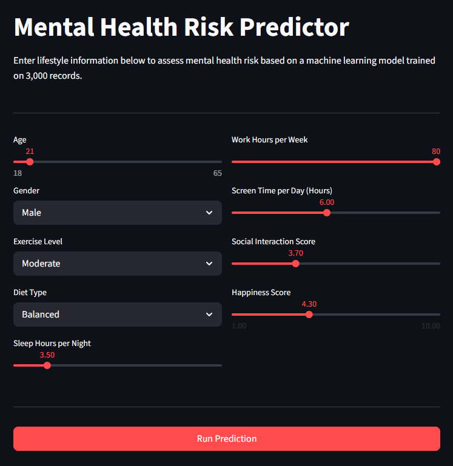
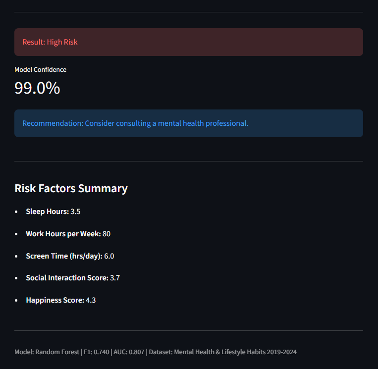

# Mental Health Risk Predictor

Predicts whether an individual is at high or low risk for a mental health condition based on lifestyle factors such as sleep, screen time, work hours, and social interaction.

**Live Demo:** https://mental-health-predictor-0.streamlit.app/

**Live API:** https://mental-health-predictor-t0og.onrender.com/docs

## Demo

## Problem

Mental health conditions affect 1 in 4 people globally, yet most go undetected until they reach a critical stage. Early identification of at-risk individuals based on lifestyle patterns allows for timely intervention — reducing long-term healthcare costs and improving outcomes.

This project demonstrates how machine learning can be applied to lifestyle data to flag high-risk individuals, a use case directly applicable to HR platforms, wellness apps, and healthcare providers.

## Dataset

- Source: Mental Health and Lifestyle Habits Dataset (2019–2024), Kaggle
- 3,000 records across 12 features
- Features: age, gender, sleep hours, exercise level, diet type, work hours, screen time, social interaction score, happiness score
- Target: binary risk classification (High Risk / Low Risk)

## Model Performance

| Model | F1 Score | AUC |
|---|---|---|
| Logistic Regression | 0.707 | 0.817 |
| Random Forest | 0.740 | 0.807 |
| XGBoost | 0.714 | 0.792 |

Best model: Random Forest (F1: 0.740). Sleep Hours is the strongest predictor (importance: 0.477).

## How to Run Locally

    git clone https://github.com/tarekjundi10/mental-health-predictor.git
    cd mental-health-predictor
    pip install -r requirements.txt
    python src/train.py
    uvicorn app.main:app --reload

Open http://127.0.0.1:8000/docs

## API Example

POST `/predict`:

    {
      "age": 28,
      "gender": 1,
      "exercise_level": 1,
      "diet_type": 0,
      "sleep_hours": 4.5,
      "work_hours_per_week": 55,
      "screen_time_per_day": 8.0,
      "social_interaction_score": 3.2,
      "happiness_score": 3.5
    }

Response:

    {
      "risk_level": "High Risk",
      "confidence": 0.97,
      "recommendation": "Consider consulting a mental health professional."
    }

## Tech Stack

Python · scikit-learn · XGBoost · FastAPI · Streamlit · pandas · Render
